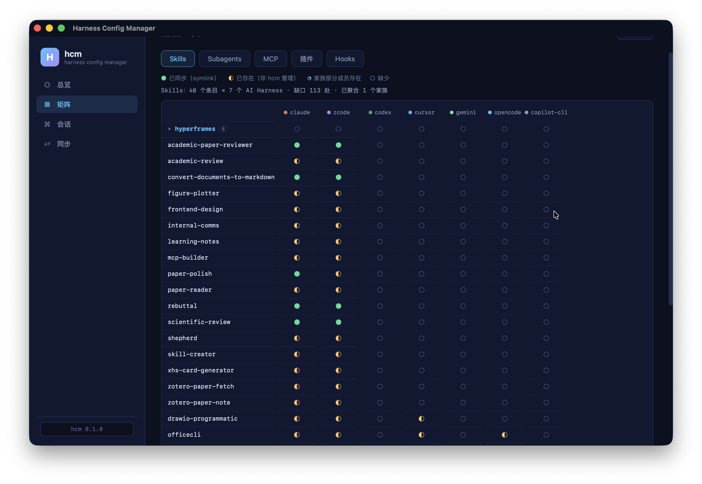
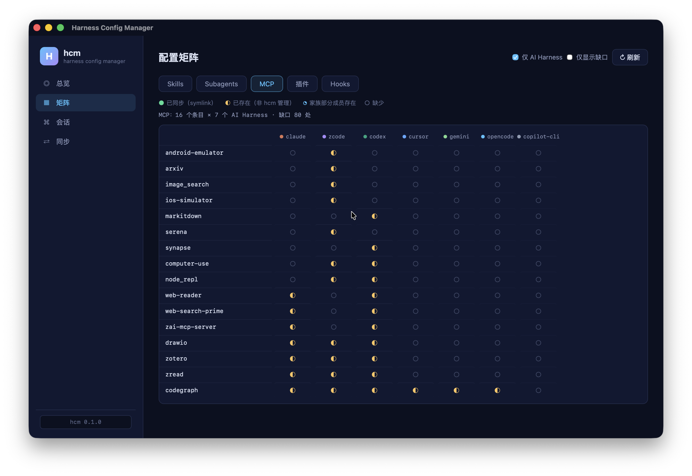

# harness-config-manager (`halter`)

Detect, inventory, and distribute user-level **skills / MCP servers / plugins / hooks / subagents**, and recall project-scoped **session history** across all your AI coding harnesses — from a single source of truth.

[中文文档](README.zh-CN.md)

## Why

A serious AI-assisted developer typically runs several coding harnesses side by side — Claude Code, Codex, Cursor, VS Code Copilot, Gemini CLI, OpenCode, ZCode… Each one keeps its **own** user-level skills, MCP server configs, plugins, hooks (commands that run automatically before/after specific agent actions), subagents (per-agent Markdown definitions), and session transcripts, in its own format (JSON with `mcpServers` vs `servers` vs `.mcp`, TOML `[mcp_servers.*]`, array-style commands…). They drift apart silently: a skill lands in one tool but never reaches the others, an MCP server gets registered twice with different definitions, a config pointing at a deleted project keeps failing on every startup.

`halter` treats those five layers as one managed state, plus a read-only session-continuity layer:

- **Detect** which harnesses are installed (CLI presence + config directories, 13 tools known).
- **Inventory** what each one has — as coverage matrices (tool × skill, tool × MCP server, tool × plugin, tool × hook, tool × subagent), plus health checks (broken symlinks, unparseable configs, dead MCP entries whose command no longer exists, unresolved secret placeholders).
- **Distribute** from a single source of truth to every tool: skills and subagents as per-entry symlinks, MCP definitions translated across six config dialects, plugins installed via each family's native mechanism, hooks translated across three dialects (claude / zcode / cursor).
- **Continue work across harnesses**: list every assistant's sessions for the current project, inspect one transcript on demand, and generate a deterministic handoff without rewriting vendor session stores.

## How it compares

| | **halter** | [nesjett/acm](https://github.com/nesjett/agent-config-manager) | [agentsync](https://github.com/dallay/agentsync) | [AgentsMesh](https://samplexbro.github.io/agentsmesh/) | [Bridle](https://github.com/neiii/bridle) |
|---|---|---|---|---|---|
| Core model | single source of truth → all tools, repeatable | point-to-point copy `--from A --to B` | symlink sync | single `.agentsmesh` dir convention | install from GitHub repos |
| Scope | **user-level** global config | project-level files (`CLAUDE.md`, `.cursorrules`…) | user-level | user-level | user-level |
| Layers | skills + MCP + plugins + hooks + **subagents** + read-only project sessions | instructions, rules, skills, MCP | config + MCP | rules + MCP + skills | skills + agents + commands + MCP |
| Detection / inventory / health checks | ✅ (13 tools, coverage matrices, doctor) | ❌ | ❌ | ❌ | ❌ |
| Secret handling | `${VAR}` placeholders + 0600 secrets file, redacted output | ❌ | ❌ | ❌ | ❌ |
| Tech | Python + uv | TypeScript (Deno) | Rust | — | Rust |

## Screenshots

**Config matrix** — harness × skills / subagents / MCP / plugins / hooks coverage at a glance (skill families collapse into one row, expandable):



**Cross-assistant sessions** — unified project / harness / timeline facets, full-text search, redacted transcripts, and one-click handoff generation:



## Install

Requires Python 3.12+ and [uv](https://docs.astral.sh/uv/):

```bash
uv tool install harness-config-manager
```

Or from source:

```bash
git clone https://github.com/pengkangzhen/harness-config-manager.git
uv tool install --editable ./harness-config-manager
```

## Quick start

Three commands. That's it.

```bash
halter scan                   # look: which tools are installed, what each has, any health issues
halter scan -d skills -d mcp  # per-layer detail; --json for machine-readable output

halter sync                   # sync: manifest/library -> all tools (dry-run by default)
halter sync --apply           # actually write (conflicts skipped by default)
halter sync --no-skills --no-plugins --no-mcp   # only hooks + sessions (all layers on by default)
halter sync --prefer library  # on conflict, override the tool-side copy from the manifest

halter sessions list          # current project's sessions across local AI coding assistants
halter sessions install       # distribute the halter-sessions lookup skill (dry-run)
halter sessions install --apply
```

The `sessions` layer only installs a lookup skill. It never copies, rewrites, or "adopts" session transcripts. When a manifest is empty, `sync` auto-collects from your best-equipped tool (the one with the most MCP servers / most enabled plugins / most hooks; override with `--from`). Third-party-injected hook entries are adopted too — keep specific ones out via `exclude_hooks`. Skills that exist nowhere in the library are adopted automatically; same-name divergent copies are reported for you to adjudicate.

## Task dispatch: @ different harnesses from one interface

Beyond reading history, `halter run` dispatches work. It invokes each harness in headless mode, runs them concurrently in one terminal with `[claude]` / `[codex]` prefixes, and archives every task:

```bash
halter run "@claude fix the failing tests/test_auth.py cases"
halter run "@codex @zcode propose database migration plans and compare"  # fan-out
halter run "@claude/sonnet quick fix / @claude/opus deep refactor"       # same harness, different LLMs
halter run "@opencode/zhipu/glm-4.7 give a second opinion"               # provider/model routing
halter run "@claude @codex review the current diff" --mode yolo          # skip confirmations (careful)
halter run "@claude long task" --detached                                 # background, returns task id

halter tasks list
halter tasks show <task-id>
```

Routing targets and headless invocation:

| Mention | Headless call |
|---|---|
| `@claude` (alias `@cc`) | `claude -p` |
| `@codex` (alias `@cx`) | `codex exec` |
| `@zcode` (alias `@z`) | `zcode --prompt --cwd` (resolved via PATH / `ZCODE_CLI` / macOS app-bundle CLI) |
| `@opencode` (alias `@oc`) | `opencode run` |

**Configurable LLMs**: specify inline via `@harness/model` (e.g. `@claude/opus`, `@codex/o3`, `@opencode/zhipu/glm-4.7` — everything after the first `/` is the model name), or set per-harness defaults in `~/.config/halter/config.toml` (inline wins):

```toml
[models]
claude = "sonnet"
codex = "o3"
opencode = "zhipu/glm-4.7"
halter = "openai/gpt-5"       # native AHP provider
```

`halter models` shows the current mapping. Flags: claude `--model`, codex `-m`, opencode `-m`; ZCode has no public headless model switch in v1 (recorded, not injected).

Safety: `--mode safe` is the default (each harness keeps its own permission gates); `--mode yolo` maps to each tool's bypass flags. Prompts are passed as single argv elements — never through a shell. Task records live under `~/.config/halter/tasks/` (0700/0600) and output is redacted when displayed. Ctrl-C or `--timeout` kills the whole process group in foreground mode.

The desktop **Model** view configures non-secret OpenAI-compatible routing (base URL plus API-key environment-variable name) without storing credentials.

The desktop app includes a read-only native-agent **Audit** view for model/tool decisions, approvals, rollbacks, and context compaction.

The desktop app's **Dispatch** view wraps the same capability: mention chips, availability badges, project picker, and live task cards.

## AHP: self-hosted Agent Host (protocol-level harness mounting)

`halter ahp serve` starts a standalone server speaking [Agent Host Protocol 0.9.0](https://microsoft.github.io/agent-host-protocol/) (WebSocket + JSON-RPC), mounting claude / codex / zcode / opencode as standard AHP agent backends:

```bash
halter ahp serve --port 7433
```

The host binds to localhost and writes a random bearer token to `~/.config/halter/ahp-token` (`0600`). Every WebSocket, JSON-RPC, and SSE request must send it as `Authorization: Bearer <token>` (or `?token=`); browser requests must also match an explicitly configured origin. The desktop reads the same token file and validates the host with an authenticated ping. Browser origins can be allow-listed with `HALTER_AHP_ALLOWED_ORIGINS=vscode-webview://...,https://your-app.example` — do not use `*`.

Any AHP client (VS Code Agents window, AHPX, official Rust/TS/Go/Swift/Kotlin client libraries) can then `initialize` → `createSession(provider="claude")` → `createChat` → dispatch `chat/turnStarted` and receive streaming `chat/delta` actions until `chat/turnComplete`. Model routing flows from `[models]` config and `message.model.id` into each harness's `--model` / `-m` flag. Execution reuses the runner layer (process groups, headless argv building).

A fifth backend, `provider="halter"`, runs Halter's native auditable agent loop with durable, redacted session/model-tool history. It exposes a durable planning tool (`update_plan`), workspace-confined read/project-memory tools (`read_file`, `list_dir`, `search_files`, `git_status`, `git_diff`, `list_project_sessions`, `read_project_session`) plus approval-gated `apply_patch` with per-transaction rollback and fixed `run_tests`, can concurrently delegate Claude/Codex/ZCode/OpenCode to disposable git clones with tracked+untracked snapshots and side-by-side diff comparison, supports streaming OpenAI- and Zhipu-compatible model routing, emits structured tool/approval events, and writes every model/tool/permission decision to a private JSONL audit trail. External runner invocations and output are audited too. See [docs/native-agent.md](docs/native-agent.md) and the handoff/roadmap in [docs/native-agent-handoff.md](docs/native-agent-handoff.md).

```bash
uv run pytest tests/test_agent_runtime.py tests/test_ahp_host.py   # native runtime + protocol e2e
```

## Session continuity

Switching from Claude Code to Codex (or any other assistant) should not erase the project's working history.

```bash
# From any assistant with shell access, or after installing halter-sessions:
halter sessions list --project . --json

# Read only the selected session, never ingest every transcript:
halter sessions show claude:<session-id> --transcript --tail 80

# Produce a private, deterministic, redacted handoff:
halter sessions context claude:<session-id>
halter sessions context claude:<session-id> --output .halter/HANDOFF.md

# Search current-project history:
halter sessions search "authentication migration" --project .
```

Native metadata readers cover Claude Code, ZCode, Codex CLI, and OpenCode. If [ctx](https://ctx.rs) is installed and initialized, `halter sessions list` also includes ctx-indexed providers (Cursor, Gemini CLI, Copilot CLI, Continue, and many more) without duplicating native entries. `ctx` is optional; halter invokes only its read-only `list events` and `show session` surfaces.

The built-in `halter-sessions` skill teaches every detected assistant the same lookup workflow. `halter sync --sessions` (on by default) or `halter sessions install --apply` distributes it through the normal skills library. Transcripts are read only when `--transcript`, `search`, or `context` is explicitly requested; obvious credentials are redacted, and prior commands are presented as historical evidence rather than executable instructions.

## The five managed config layers

| Layer | Source of truth | Distribution |
|---|---|---|
| skills | skills library dir (fallback chain: config-specified > `~/.agents/skills` > `~/.config/halter/library/skills`) | per-entry symlinks; same-name conflicts skipped by default, `--prefer library` to override |
| subagents | subagents library dir (fallback chain: config `agents_library` > `~/.agents/agents` > `~/.config/halter/library/agents`) | per-entry symlinks (each agent is one `.md` file); same conflict semantics as skills; frontmatter (`model: opus`, …) is distributed as-is — aliases may not resolve in non-Claude-family tools |
| MCP | `~/.config/halter/mcp.toml` (canonical: stdio/http, env, headers) | six dialect writers: claude (read-modify-write of `~/.claude.json`), zcode, codex (TOML, comments preserved), cursor, vscode (`servers` key), gemini, opencode (array-style command); http-type servers only go to tools that support them |
| plugins | `~/.config/halter/plugins.toml` (families: claude / codex / vscode) | claude via `claude plugin install -y`; zcode mirrors the claude-side cache + registers the same-origin manifest; codex via TOML toggle; vscode via `code --install-extension` |
| hooks | `~/.config/halter/hooks.toml` (per registration: id, events, matcher, command, timeout in seconds) | three dialect writers: claude (top-level `hooks` of `settings.json`), zcode (`hooks.events` in `cli/config.json`, timeouts converted ms→s), cursor (flat two-level `hooks.json`); every entry halter writes carries an `"halter": "<id>"` ownership tag — **entries without it (injected by Otty, Orca, …) are never touched**; tool-unsupported events (cursor-only like `beforeShellExecution`, claude-only like `PermissionRequest`) are skipped with a note |

## Safety design

- **Every write is dry-run by default**; `--apply` is required. Replacements are backed up to `~/.config/halter/backups/<timestamp>/`.
- **Secrets never enter the manifest**: values that look like keys become `${VAR}` placeholders; real values live in `~/.config/halter/secrets.toml` (mode 0600). At sync time placeholders resolve from the environment first, then the secrets file; a server with an unresolvable secret is skipped entirely, never half-written. Terminal output is always redacted.
- `~/.claude.json` (a large state file) is only ever read-modify-written key-by-key, atomically.
- Hook sync only ever touches entries carrying halter's own `halter` ownership tag — hooks written by third-party managers (Otty, Orca, …) are never modified or deleted; zcode's global `hooks.enabled` switch stays yours, halter won't toggle it.

## Configuration

`~/.config/halter/config.toml` (optional):

```toml
library = "~/.agents/skills"     # skills source of truth; defaults to the fallback chain
exclude_skills = []              # skills to never distribute
exclude_mcp = []
exclude_hooks = []               # hook ids to never distribute (see hooks.toml / scan -d hooks)
agents_library = ""              # subagents source of truth; defaults to the fallback chain
exclude_agents = []              # agent names to never distribute
```

## Supported tools

Claude Code · ZCode · OpenAI Codex · Cursor · VS Code (Copilot) · Gemini CLI · OpenCode · GitHub Copilot CLI · Continue · Cline · Trae · Aider Desktop · Windsurf

Adding a tool = one `ToolSpec` entry in `registry.py` (detection + skills layer work immediately); MCP/plugin support needs the tool's dialect reader/writer; hooks likewise live in `hooks.py` / `hooks_write.py`; subagents need just an `agents_dirs` entry.

## Limitations (v1)

- Cursor plugins are inventoried but not installed (marketplace mechanism is opaque).
- Continue / Cline / Trae / Aider / Windsurf are covered on the skills layer only.
- The zcode plugin target requires the plugin to be installed on the claude side first (mirror source).
- The hooks layer covers claude / zcode / cursor only (Codex has just a weak `notify` callback; the other tools have no equivalent); Cursor's prompt-type hooks distribute to cursor only.
- The subagents layer covers claude / zcode / cursor only; frontmatter fields like `model: opus` are Claude-family aliases and are distributed as-is (they may not resolve elsewhere).
- Session continuity natively covers Claude Code, ZCode, Codex CLI, and OpenCode; install optional ctx for broader provider coverage. halter itself does not yet implement native Gemini or Cursor transcript parsers.
- Dead-hook detection is conservative: existence is only checked for commands that are a single script path; compound shell expressions are neither checked nor false-positived.
- MCP servers injected by a harness at runtime for its own plugins (e.g. ZCode's `node_repl` via browser-use) rely on a small built-in mapping table.

## Development

```bash
uv sync
uv run pytest               # 63 tests, all against a fake $HOME — never touches your real config
```

## License

MIT

## Desktop App (Tauri + halter sidecar)

`desktop/` ships a Tauri v2 desktop app:

- **Overview dashboard**: detected tools, five-layer counts (skills / subagents / MCP / plugins / hooks), doctor issues
- **Cross-assistant session browser**: project session list, redacted transcripts, full-text search, one-click handoff generation
- **Sync**: per-layer toggles + dry-run preview; Apply requires two-step confirmation and keeps the CLI's safety semantics

The frontend is plain static files (no build step) talking to Rust commands over Tauri IPC; the Rust side executes `halter --json` as a sidecar. Sidecar resolution order: `HALTER_BINARY` env var → bundled `halter` executable next to the app → `halter` on PATH.

### Development

```bash
cd desktop
npm install
HALTER_BINARY=../devbin/halter npm run dev   # use the repo's .venv halter instead of the global one
```

Requires Node 18+, a Rust toolchain, and Xcode Command Line Tools (macOS).

### Build

```bash
cd desktop
npm run build
```

For release distribution, place a PyInstaller-built `halter` binary at `desktop/src-tauri/binaries/halter-<target-triple>` and declare it as `externalBin` in `tauri.conf.json` so it ships inside the app bundle.
