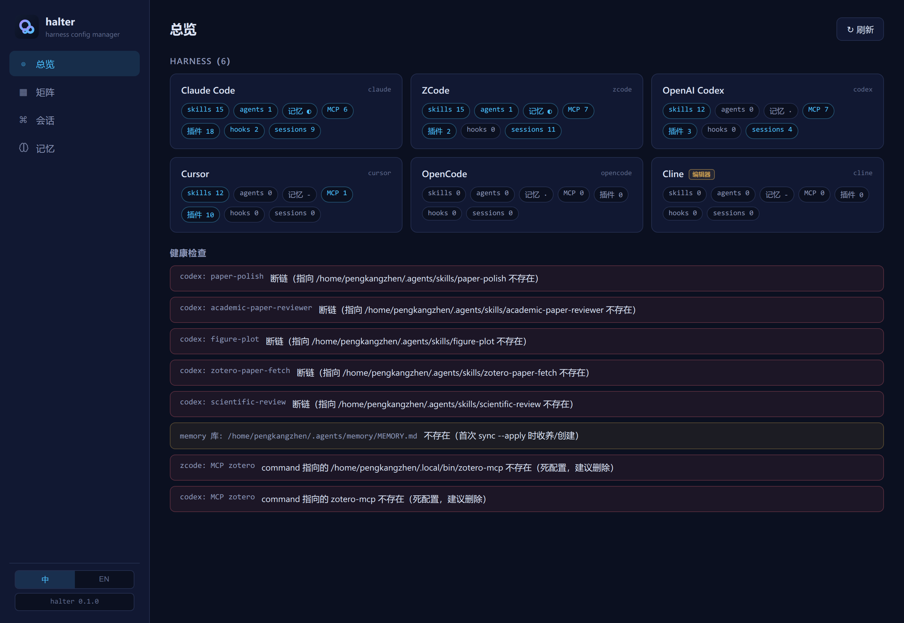
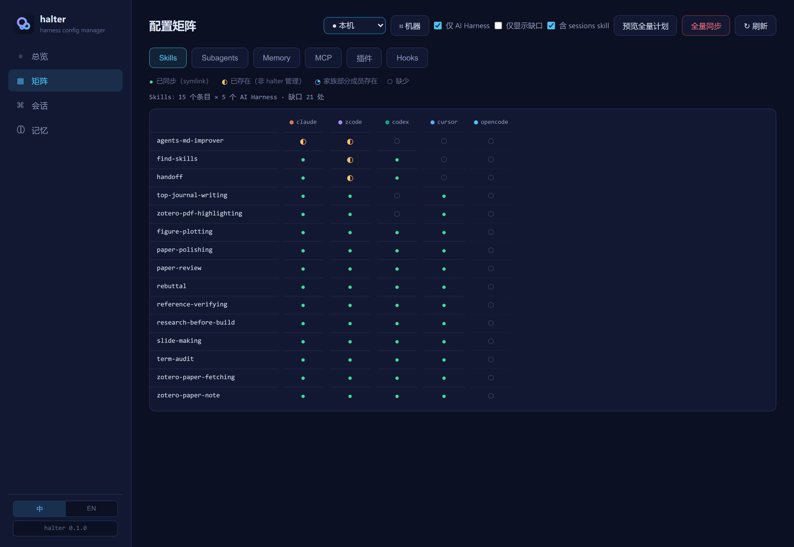
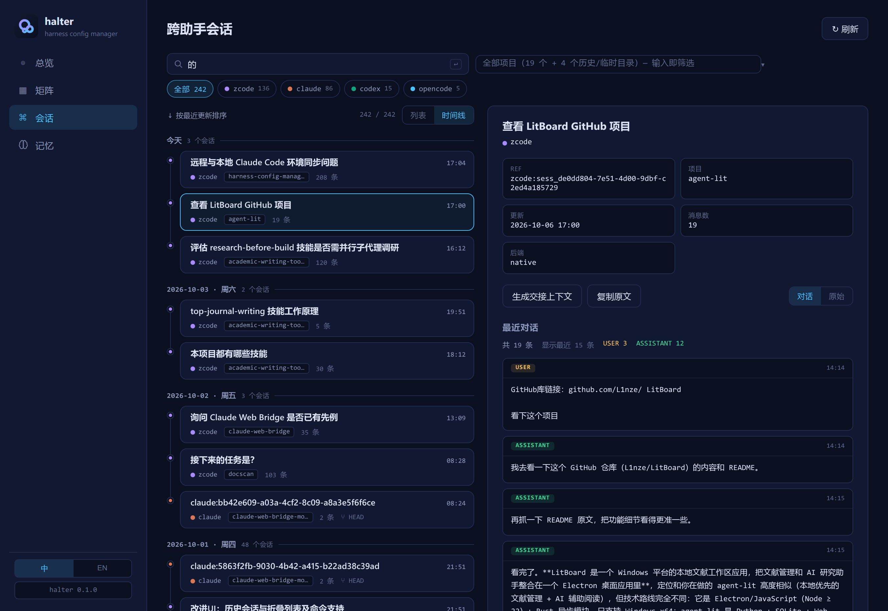

# harness-config-manager (`halter`) // [中文文档](README.zh-CN.md)

统一检测、盘点、分发 AI 编码工具的用户级 **skills / MCP servers / 插件 / hooks / subagents**，并可调取当前项目的跨助手历史会话。

一台机器上往往装着多个 AI 编码工具（Claude Code、ZCode、Codex、Cursor、VS Code Copilot、Gemini CLI、OpenCode……），每个工具各管一套用户级 skills、MCP 配置、插件、hooks（钩子：在工具执行特定动作前后自动运行的 shell 命令）、subagents（子代理：每代理一个 Markdown 定义文件）、用户级记忆（CLAUDE.md / AGENTS.md / GEMINI.md 等全局指令文件，各工具内容极易漂移）和 session 记录，格式互不相同（JSON 的 `mcpServers`/`servers`/`.mcp`、TOML 的 `[mcp_servers.*]`、command 数组……），配置渐渐各自为政。`halter` 用单一事实源统一管理这六层配置：先检测与盘点，再按需分发；session 记录则作为只读的项目连续性能力单独调取。

## 界面预览

**总览** —— 一屏看清检测到的每个 AI 编码工具、五层配置计数与健康检查结果：



**配置矩阵** —— Harness × Skills / Subagents / MCP / 插件 / Hooks，谁装了、谁缺了一目了然（skill 家族自动聚合，可展开明细）。点一下任意未同步的圆点，即定向同步该条目到该工具（CLI 等价 `halter sync --tool <tool> --item <name> --apply`；家族聚合格一点同步整个家族）。工具栏同时承载全量同步：预览 dry-run 计划，或两步确认后全量执行（sessions skill 层可开关）：



**跨助手会话** —— 项目 / 助手 / 时间线三个维度统一筛选，支持内容搜索、脱敏 transcript 与一键生成交接上下文：



## 安装

```bash
uv tool install .          # 从本仓库安装，得到 halter 命令
```

依赖：Python 3.12+，typer / rich / tomlkit。

## 快速上手

核心是三个命令：

```bash
halter scan                   # 看一眼：装了哪些工具、各配置了什么 skills/MCP/插件/hooks/subagents、有无健康问题
halter scan -d skills -d mcp  # 查看某层明细；--json 输出机器可读格式

halter assess                 # 评估配置层对当前项目的有用度（语言/框架/领域信号匹配）
halter assess -p ../my-paper  # 评估指定项目；-l skills -l mcp 只看部分层；--json 机器可读

halter sync                   # 同步一下：清单/库 -> 所有工具（默认 dry-run）
halter sync --apply           # 实际执行（冲突默认跳过保护）
halter sync --no-skills --no-plugins --no-mcp   # 只保留 hooks + sessions（各层默认全开，按需关闭）
halter sync --prefer library  # 冲突时以清单覆盖（默认 skip）
halter sync --tool zcode --item paper-polishing --apply   # 收窄到一个矩阵单元格（矩阵面板点圆点的等价操作）

halter push skills paper-polishing --to desktop --apply   # 单条目：本机 -> 另一台机器
halter pull mcp zotero --from lab --apply                 # 反方向同理

halter sessions list          # 列出当前项目在所有本地 AI 编码助手中的历史会话
halter sessions install       # 分发 halter-sessions 查询 skill（默认 dry-run）
halter sessions install --apply
```

sessions 层只安装查询 skill，不复制、不改写、不“收编”任何原生 session 文件。清单为空时 `sync` 会自动从最全的工具收集（MCP 选 server 最多的，插件选启用最多的 claude 系工具，hooks 选条目最多的目标工具；第三方注入的 hook 条目也一并收编，排除名单走 `exclude_hooks`；`--from` 可覆盖）；skills 与 subagents 库外独有的会自动入库，同名分叉会列出让你裁决。

## 多台机器（ssh）

同样的漂移问题也存在于**机器之间**：台式机装着 Claude Code，笔记本也装着 Claude Code，两边渐渐各写各的。halter 用纯 ssh 解决——远端机器只需装好 halter 并配好 ssh 免密（公钥 / ssh-agent）；绝不存密码。

**零注册，VS Code Remote-SSH 式体验**：`~/.ssh/config` 里的非通配 `Host` 别名（Include 递归跟随）自动成为可选机器——HostName / User / Port / ProxyJump 全部由 ssh 自己解析。`halter machines add` 仍可用于覆盖别名或指定自定义 `halter_path`：

```bash
halter machines list             # 手动注册（machines.toml）+ 自动发现（~/.ssh/config）
halter machines test desktop     # 连通性 + 远端 halter 可用性检查，带诊断建议

# 像操作本机一样操作远端
halter scan --machine desktop --json
halter sync --machine desktop --apply

# 在机器之间搬单个条目（skills / agents / mcp / hooks）
halter push skills paper-polishing --to desktop --apply
halter push mcp zotero --to desktop --with-secrets --apply   # 连同密钥真实值（ssh 加密通道）
halter push hooks my-gate --to desktop --apply               # 命令含本机路径时会警告
halter pull agents reviewer --from desktop --apply           # = push --from desktop，目标为本机
```

语义：条目经幂等的 export/ingest 对传输——同名同内容视为 no-op；同名不同内容报冲突（默认跳过，`--prefer replace` 先备份目标侧再覆盖）。条目到达后落入远端库/清单，并由远端自己的 halter 分发到那台机器的已装工具——方言翻译绝不重复实现。MCP 定义以 `${VAR}` 占位符传输；真实密钥仅在 `--with-secrets` 时携带，合并进远端 `secrets.toml`（0600）。memory 层刻意不做跨机推送——单一全局记忆文件的合并语义适合 git/syncthing，不适合点对点复制。

桌面 App 走同一通道：矩阵工具栏的机器下拉可切换查看任意已注册机器；本机有而远端缺的条目显示为幽灵行（点击即推送），远端独有的条目带拉取按钮。

## Session 连续性

从 Claude Code 切到 Codex，或从任意一个助手切到另一个助手时，不需要丢失当前项目的工作历史：

```bash
# 在任意有 shell 权限的助手中，或安装 halter-sessions skill 后：
halter sessions list --project . --json

# 只读取选中的会话，不把所有 transcript 塞进上下文：
halter sessions show claude:<session-id> --transcript --tail 80

# 生成私有、确定性、脱敏的交接上下文：
halter sessions context claude:<session-id>
halter sessions context claude:<session-id> --output .halter/HANDOFF.md

# 搜索当前项目历史：
halter sessions search "authentication migration" --project .
```

原生 metadata 读取器覆盖 Claude Code、ZCode、Codex CLI、OpenCode。如果安装并初始化了 [ctx](https://ctx.rs)，`halter sessions list` 还会纳入 ctx 已索引的 Cursor、Gemini CLI、Copilot CLI、Continue 等更多来源，并与原生结果去重。ctx 是可选依赖；halter 只调用其只读的 `list events` / `show session` 接口。

内置 `halter-sessions` skill 会教所有已检测助手同一套查询流程。`halter sync --sessions`（默认开启）或 `halter sessions install --apply` 通过正常 skills library 分发。只有显式使用 `--transcript`、`search` 或 `context` 时才读取 transcript；明显凭据会脱敏，历史命令只作为证据展示，不作为可执行指令。

## 模型供应商切换

Claude Code 与 Codex 都能跑在任何 Anthropic / OpenAI 兼容端点上（GLM、DeepSeek、本地网关、中转……），但接线散落在各家不同的配置文件里。halter 用一份供应商清单（`~/.config/halter/providers.toml`）管理，一条命令切换工具当前激活的供应商。供应商**刻意只属于本机**——它是身份而非可分发配置，`push`/`pull` 永不携带。

```bash
# 收编现有配置（如 CC Switch 写好的那套）进清单：
halter providers adopt --apply

# 列出供应商与各工具当前激活者（按真实配置文件实测推断）：
halter providers list

# 从内置预设新增（端点自动填，模型名自选）并切换；
# token 只进 secrets.toml（0600），永不进清单：
echo "$KEY" | halter providers add zhipu --tool claude --preset zhipu \
  --model glm-5.3 --token-stdin
halter providers switch zhipu --tool claude

# 切回官方默认端点：
halter providers switch official --tool codex
```

内置预设（`halter providers presets`）目前覆盖 zhipu（claude + codex 双端点）、deepseek、moonshot——端点均有厂商官方文档背书；预设只固化端点，模型名始终由你自填。每次切换前都会把目标文件副本存入 `~/.config/halter/backups/providers/`，切坏了拷回来即可回滚。

只动自家的键：claude 侧仅写 `~/.claude/settings.json` env 里的 `ANTHROPIC_*` / `CLAUDE_CODE_*_MODEL` 托管键（env 其余键保持原样）；codex 侧仅写 `model_provider` / `model` 与 `[model_providers.halter_<id>]` 段，第三方段（如 CC Switch 写的）原样保留。`doctor` 会提示清单之外的自定义端点与 cc-switch 残留痕迹，双重管理无处藏身。桌面 App 的「供应商」面板支持一键切换、表单添加（预设自动填充端点）、收编与删除。

**与 CC Switch / claude-code-router 的分工**：halter 是*静态配置层*——写的是「工具指向哪个供应商」，管密钥安全，不驻留进程。CC Switch 做同样的切换（独立 App 形态），halter 的 `adopt` 可直接收编它的配置；[claude-code-router](https://github.com/musistudio/claude-code-router) 是*运行时路由层*——常驻网关做逐请求路由、fallback 与可观测性。两层可组合：把本地网关端点注册为 halter 的一个普通 provider，像切换其它供应商一样切换到它。

## 六个配置层

| 层 | 事实源 | 分发方式 |
|---|---|---|
| skills | skills 库目录（默认 `~/.agents/skills`；可用配置 `library` 覆盖；旧自管库 `~/.config/halter/library/skills` 首次解析时自动迁移） | 条目级 symlink；同名冲突默认跳过，`--prefer library` 备份后覆盖 |
| subagents | subagents 库目录（默认 `~/.agents/agents`；可用配置 `agents_library` 覆盖；旧路径自动迁移） | 条目级 symlink（每代理一个 `.md` 文件）；冲突语义与 skills 相同；frontmatter 字段（如 `model: opus`）原样分发，Claude 系别名在其它工具可能无效 |
| memory | 单一记忆文件（默认 `~/.agents/memory/MEMORY.md`；可用配置 `memory_file` 覆盖） | symlink 到各工具的用户级记忆文件（claude `~/.claude/CLAUDE.md`、zcode/codex/opencode `AGENTS.md`、gemini `GEMINI.md`）；在任一工具侧编辑即改库文件，天然保持一致；库缺失时自动从工具侧收养（各工具内容不一致需 `--from <tool>` 裁决）；冲突语义与 skills 相同 |
| MCP | `~/.config/halter/mcp.toml`（canonical：stdio/http、env、headers） | 六方言转换写入：claude（`.claude.json` 读改写）、zcode、codex（TOML 保注释）、cursor、vscode（`servers` 键）、gemini、opencode（command 数组）；http 类型只分发支持的工具 |
| 插件 | `~/.config/halter/plugins.toml`（family: claude / codex / vscode） | claude 用 `claude plugin install -y`；zcode 镜像 claude 缓存 + 登记同源清单；codex 写 TOML 开关；vscode 用 `code --install-extension` |
| hooks | `~/.config/halter/hooks.toml`（每条注册：id、事件列表、matcher、命令、超时秒） | 三方言转换写入：claude（`settings.json` 顶层 `hooks`）、zcode（`cli/config.json` 的 `hooks.events`，超时自动换算毫秒）、cursor（`hooks.json` 扁平结构）；写入条目带 `"halter": "<id>"` 归属标记，**只增删改自家电位，第三方注入的无标记条目一律不碰**；仅 cursor 支持的事件（如 `beforeShellExecution`）或 claude 独有事件（如 `PermissionRequest`）分发到无此事件的工具时跳过并提示 |

## 安全设计

- **一切写操作默认 dry-run**，`--apply` 才执行；skills 替换前自动备份到 `~/.config/halter/backups/<时间戳>/`。
- **密钥永不进清单**：`adopt --mcp` 把疑似密钥的值换成 `${VAR}` 占位符，真实值写入 `~/.config/halter/secrets.toml`（权限 0600）；同步时按 环境变量 > secrets 展开，缺变量的 server 整体跳过，不写半截配置；终端输出永远脱敏。
- `~/.claude.json` 是大状态文件，只做读-改-写合并（保留其余键），原子替换落盘。
- hooks 同步只触碰自己打标（`halter` 键）的条目——Otty、Orca 等第三方管理器写入的 hook 永不被修改或删除；zcode 的 `hooks.enabled` 全局开关由你手动控制，halter 不代管。

## 配置

`~/.config/halter/config.toml`（可选）：

```toml
library = "~/.agents/skills"     # skills 事实源；缺省即此路径
exclude_skills = []              # 不分发的 skill 名单
exclude_mcp = []
exclude_hooks = []               # 不分发的 hook id 名单（id 见 hooks.toml / scan -d hooks）
agents_library = ""              # subagents 事实源；缺省为 ~/.agents/agents
exclude_agents = []              # 不分发的 subagent 名单
memory_file = ""                 # 用户级记忆事实源；缺省为 ~/.agents/memory/MEMORY.md
```

## v1 边界

- Cursor 插件仅盘点不安装（市场机制不透明）。
- 供应商切换仅覆盖 claude / codex（ZCode 无文件级模型配置、Gemini CLI 本机未装），且刻意只属于本机：供应商身份永不随 `push`/`pull` 跨机同步。
- Continue / Cline / Trae / Aider / Windsurf 仅覆盖 skills 层。
- `sync --plugins` 的 zcode 目标要求该插件在 claude 侧已安装（镜像来源）。
- hooks 层仅 claude / zcode / cursor 三家支持（Codex 只有弱 notify 回调，其余工具暂无对等机制）；Cursor 的 prompt 型 hook 仅随 cursor 目标分发。
- subagents 层仅 claude / zcode / cursor 三家支持；frontmatter 里的 `model: opus` 等是 Claude 系别名，原样分发（在其它工具可能不生效）。
- memory 层仅覆盖有单一用户级 Markdown 指令文件的工具（claude / zcode / codex / gemini / opencode）；Cursor 的 rules 需 `.mdc` frontmatter、Windsurf / VS Code Copilot 的全局规则路径随版本变动，暂未接入。
- Session 连续性原生覆盖 Claude Code / ZCode / Codex / OpenCode；如需更多 provider，可安装可选 ctx。halter 自身暂未实现 Gemini / Cursor 原生 transcript parser。
- hook command 的死配置检测是保守的：仅对「单一脚本路径」形式的命令判定存在性，复合 shell 表达式不误报也不检查。

## 支持新工具

在 `registry.py` 的 `TOOLS` 中追加一条 `ToolSpec`（CLI 命令名、配置目录、skills 目录），检测与 skills 层即刻生效；MCP / 插件层需在 `mcp.py` / `mcp_write.py` / `plugins.py` / `plugin_sync.py` 中补充该工具的方言读写器；hooks 层同理见 `hooks.py` / `hooks_write.py`；subagents 只需加 `agents_dirs` 条目；memory 只需加 `memory_files` 条目。

## 测试

```bash
uv run pytest               # 151 项单测，全部使用假 HOME，绝不触碰真实配置
```

## 在 DeepSeek Harness（dsh）中使用

社区插件 **`dsh-halter`** 把本 CLI 接入 [DeepSeek Harness](https://www.deepseek.com/harness/en)：

```bash
dsh plugin --profile web add dsh-halter
```

插件注册 `halter_cli` 只读 agent 工具（scan / assess / sessions list·show·context·search），以及面向人类的 `/halter` 斜杠命令（完整 CLI）——写操作（`sync --apply`、`sessions install`）永远不会开放给模型。源码在 [`dsh-plugin/`](dsh-plugin/)；halter 本体需单独安装（`uv tool install harness-config-manager`）。

## 桌面 App（Tauri + halter sidecar）

`desktop/` 内置一个 Tauri v2 桌面应用：

- **总览仪表盘**：检测到的工具、六层配置（skills / subagents / memory / MCP / 插件 / hooks）计数、健康检查问题
- **记忆面板**：查看并编辑记忆事实源，逐工具展示副本状态与差异（unified diff），保存自动备份旧文件
- **跨助手会话浏览器**：项目会话列表、脱敏 transcript、内容搜索、一键生成交接上下文
- **同步**：分层勾选 + dry-run 预览；Apply 需两步确认，保留 CLI 的安全语义
- **多机视图**：矩阵工具栏机器下拉——`~/.ssh/config` 的 Host 别名自动出现（零注册），也可经 `halter machines add` 或应用内面板手动注册；切到远端机器后，本机有而远端缺的条目显示为幽灵行（点击推送），远端独有条目带拉取按钮
- **中英双语界面**：侧边栏一键切换，选择按设备记忆

前端为纯静态文件（无构建步骤），通过 Tauri IPC 调用 Rust 命令；Rust 侧以 sidecar 方式执行 `halter --json`。sidecar 解析顺序：`HALTER_BINARY` 环境变量 → 应用旁打包的 `halter` 可执行文件 → PATH 上的 `halter`。

### 开发

```bash
cd desktop
npm install
HALTER_BINARY=../devbin/halter npm run dev   # 使用本仓库 .venv 中的 halter，而非全局安装版
```

依赖：Node 18+、Rust toolchain、Xcode Command Line Tools（macOS）。

### 构建

```bash
cd desktop
npm run build
```

`npm run build` 已自动化整个流程：`build:sidecar` 脚本（`scripts/build_sidecar.sh`）先用 PyInstaller 打出 onefile 二进制到 `desktop/src-tauri/binaries/halter-<target-triple>`（源码未变时增量跳过，`FORCE_SIDECAR=1` 强制重打），`tauri.conf.json` 已声明 `externalBin`，Tauri 自动把它带进 .app/.dmg。
